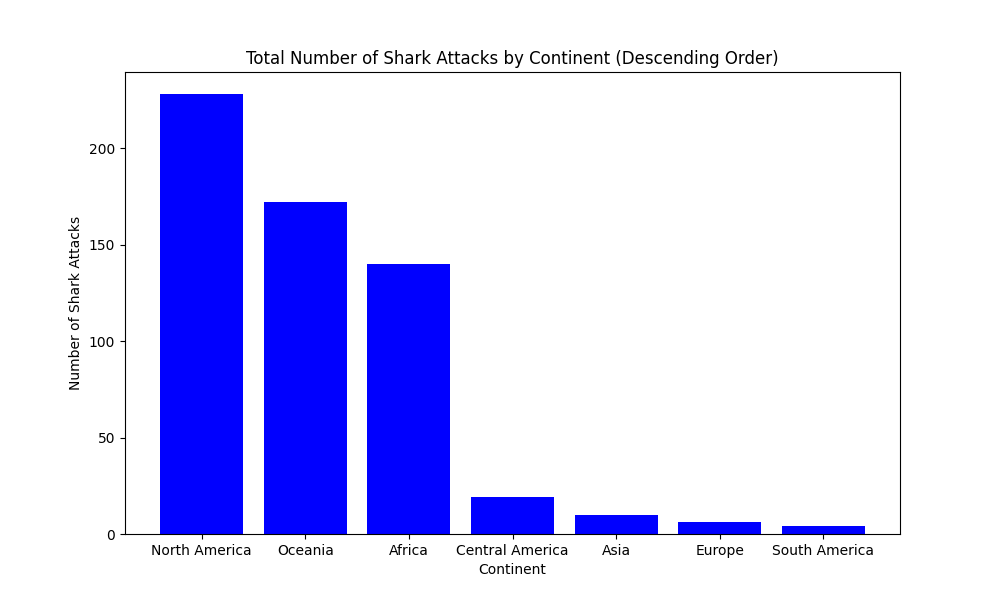

SHARK ATTACK ANALYSIS

We are analyzing a database that records shark attacks. To do this, I performed a general cleaning of the table to reach the data and the reformulated hypotheses below:

- Cleaning duplicates, using a drop duplicates function.
- Cleaning null data in rows, using a function. In this case, the threshold is set at 90%.
- Cleaning unnecessary columns. Using the drop function.

- Leaving an output with the following columns:
Day, Month, Year, Continent, Sex, Year, Activity, Species, Attack Time, Attack Type, Injuries Associated with the Attack, and Fatality.

Hypothesis 1

a) The shark species with the most attacks are those with a higher fatality rate.

--> It could be because more attacks lead to a higher possibility of fatalities.

b) The shark species with the most attacks do not have a higher fatality rate.

--> Since these encounters are more frequent with humans, they become more accustomed to their presence, resulting in more defensive attacks that do not end in fatality.

    VARIABLES TO CONSIDER
    SPECIES --> First, we identify the species with the highest number of attacks and only consider those with a significantly relevant number. To clean the species column, I used a regex function.
    NUMBER OF ATTACKS --> Number of shark attacks
  

    Here we see that there are 4 species with significantly higher numbers of attacks than the rest: 'White Shark', 'Tiger Shark', 'Bull Shark', and 'Blacktip Shark', so we will work with these.

    FATAL (Y/N) --> 'Y' if the victim died from the attack. 'N' if the victim did not die.

    METHOD
    Test if there is a correlation between the shark species with the most attacks and the fatality rate.

    To do this, we create a stacked bar chart with the selected species on the horizontal axis, keeping the number of attacks on the vertical axis, and adding the fatality variable.
    

    CONCLUSION

    In this case, we see that Hypothesis 1 (a), stating that the shark species with the most attacks have a higher fatality rate, is correct. We observe a positive correlation between the species with the most attacks, where 'White Shark' also has the highest number of fatalities.

Hypothesis 2

a) There are more shark attacks in the summer months because more people swim in the sea during the summer.

--> It's important to consider continents here to correlate summer months, as they are not the same for all locations.

    VARIABLES TO CONSIDER
    CONTINENT --> To determine which hemisphere the attack occurred in and accurately assess the season of the month of the attack. It's important to note that for countries in the northern hemisphere, summer is (JUN, JUL, AUG, SEP), and for those in the southern hemisphere, it's (DEC, JAN, FEB, MAR).
    NUMBER OF ATTACKS --> Number of shark attacks

    It's important to consider which continents have significant samples to include them in the analysis.

    Now we see that the continents with significant samples are 'North America', 'Africa', and 'Oceania'.

    MONTH --> Months of the year when attacks occur, expressed as numerical values from 1 to 12.

    METHOD
    Test if there is a correlation between summer months and the number of shark attacks in the most representative continents with a multiple bar chart, one for each continent. The vertical axes show the number of attacks, while the horizontal axes show the months for a clear view of attack dispersion by month.

   

    CONCLUSION

    Here, we see a positive correlation between summer months and attacks. 
    
    In the case of North America, a continent in the northern hemisphere with summer months comprising (JUN, JUL, AUG), the graph shows peaks in attacks in August and September (along with October). 
    
    For continents in the southern hemisphere, we observe more uniformity between months due to their closer proximity to the equator and thus more tropical climates. However, in both continents analyzed, Africa and Oceania, there are higher incidences in the summer months, which span from December to March.

    For Oceania, we see this difference between months more clearly due to its less tropical climate with greater climatic differentiation between seasons. In Africa, it's surprising to see the data for June and July, which are almost at the level of winter months. This can be explained by a smaller temperature difference between seasons.

Hypothesis 3

a) Sharks attack more during the day because there are more bathers or potential disturbances.
    
    aa) During the morning, as there are more daylight hours and hence more people swim.
    
    ab) During the afternoon, because people work in the morning and do not swim.

b) Sharks attack more when there is no daylight as they come out to hunt ('Evening' and 'Night').

    VARIABLES TO CONSIDER
    TIME --> Time of day of the attack, categorized into 'Morning', 'Afternoon', 'Evening', and 'Night'.
    
    NUMBER OF ATTACKS --> Number of shark attacks

    METHOD
    Determine when shark attacks occur most frequently during the day.

    We can also add the fatality variable to the analysis to see when the highest number of deaths occurs during the day.

    CONCLUSION

    Here, we see that hypothesis (a) is correct as there are more attacks during daylight hours. This is when there are more bathers. So, we discard the hypothesis that suggests there are more attacks when there is no light.

    Within hypothesis (a), we find two sub-hypotheses. We see that the time of day with the most attacks is in the afternoon (ab), where we can correlate a greater availability of potential victims to engage in aquatic activities. Afternoon is commonly associated with engaging in more leisure activities. Although we don't see much difference with attacks that occur in the morning (aa). So, we can assert that daylight is a differentiating factor for shark attacks to occur.

    Analyzing the correlation with fatalities, we don't find anything significant as the relationship between deaths by time of day is proportional to the number of attacks that occur at that time of day.

Hypothesis 4

a) Water sports involving boards are more prone to shark attacks (more than free swimming). Sharks mistake boards or paddle boards for prey and attack because they feel threatened.

    VARIABLES TO CONSIDER
    ACTIVITY --> Activities of the victims at the time of the attack
    NUMBER OF ATTACKS --> Number of shark attacks

    Here we see the number of attacks by activity. We choose significant activities that help analyze our hypothesis, taking the top 5 with the most attacks. Additionally, these top 5 can be grouped into 2 sub-groups. Those that are part of board sports activities ('Surfing' and 'Bodyboarding') and the rest that could be associated with more leisurely activities ('Fishing', 'Swimming', and 'Diving').

    INJURY --> To see the severity or type of injuries associated with each activity. In this case, we have an injury scale from less severe ('Unharmed') to more severe ('Fatal').

    METHOD
    Test if water sports involving boards pose a greater threat and the danger to both the animal and the degree of injuries associated with the attack. To do this, we create a heatmap correlating activities on the vertical axis with the range of injuries sorted by severity.

    There are two versions included: one from 1 to 50, where 1 indicates lower correlation and 50 indicates higher correlation.

    The other version ranges from 0 to 1, where 0 indicates lower correlation and 1 indicates higher correlation.

    CONCLUSION

    In this graph, we can draw several conclusions, but the first is to see that our hypothesis is not accurate. As we see in the activity variable 'Surfing', it has the highest correlation of all activities with the lowest risk 'Unharmed'. This is very close to correlations with 'Laceration' and 'Bite' injuries but with a significant difference in correlation with deaths. 
    We don't observe much significant data for the 'Bodyboarding' activity.

    For the block of activities ('Fishing', 'Swimming', and 'Diving'), we do see a higher correlation associated with more severe and especially fatal injuries. Therefore, we associate a greater danger with these types of activities, contrary to what we had asserted in our hypothesis.

OTHER CONSIDERATIONS AND GENERAL CONCLUSION

   - We have clearly answered the questions associated with the hypotheses with graphical material, so we can consider that we have achieved the objective.

   - Consider the temperature in case it correlates with increased animal aggression or not.